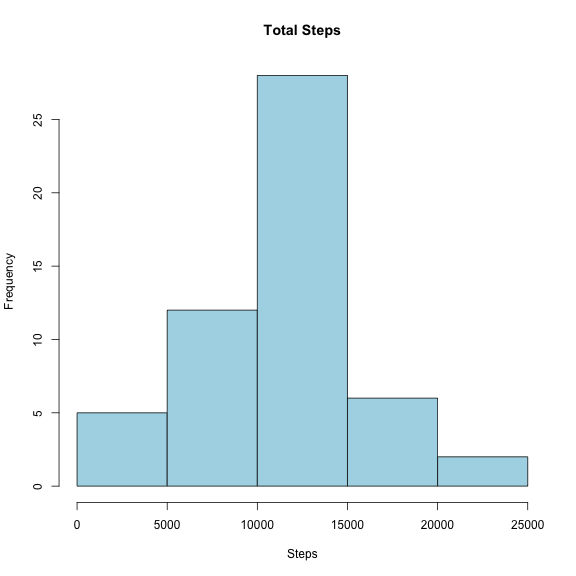
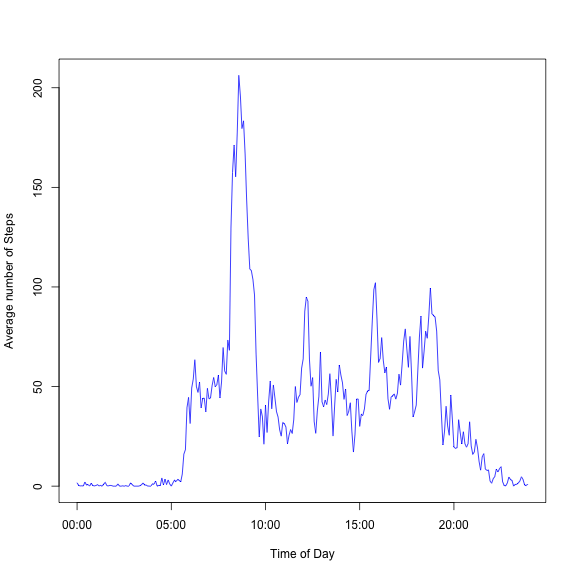
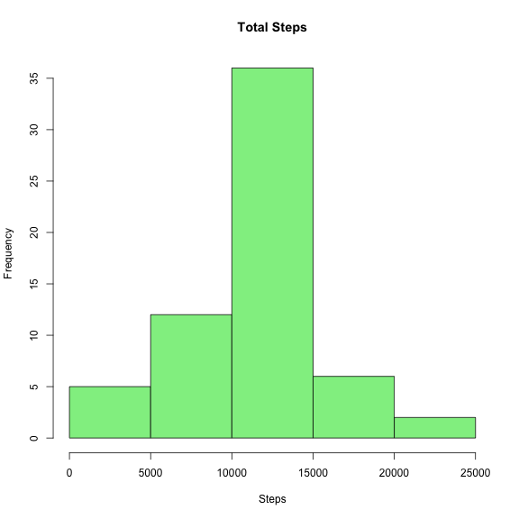
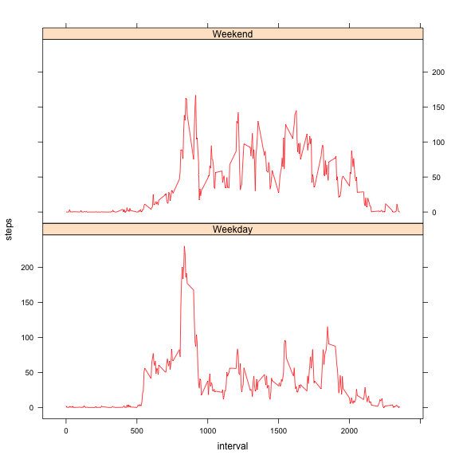

### Reproducible Research: Peer Assessment 1

## Introduction
It is now possible to collect a large amount of data about personal movement using activity monitoring devices such as a Fitbit, Nike Fuelband, or Jawbone Up. These type 
of devices are part of the “quantified self” movement – a group of enthusiasts who take measurements about themselves regularly to improve their health, to find patterns in their behavior, orbecause they are tech geeks. But these data remain under-utilized both because the raw data are hard to obtain and there is a lack of statistical methods and software for processing and interpreting the data.

This assignment makes use of data from a personal activity monitoring device. This device
collects data at 5 minute intervals through out the day. The data consists of two months ofdata from an anonymous individual collected during the months of October and November, 2012 and include the number of steps taken in 5 minute intervals each day.

## Loading and preprocessing the data

```r
# Load Libraries - plyr (for data set operations) & lattice (for plotting)
library(plyr)
library(lattice)

# Options to display mean / median as numbers (not scientific notation)
options(scipen = 5)

# Check for ./figure directory - output for plots
if (!file.exists("figure")) {
    dir.create("figure")
}

# unzip and read the data file. Data file already downloaded
acdat <- read.csv(unz("./activity.zip", "activity.csv"))
```


## What is mean total number of steps taken per day?

```r
# Total number of steps taken per Day - ignore missing (NA) values
sumbyday <- aggregate(steps ~ date, FUN = sum, data = acdat, na.action = na.omit)

# Histogram of Total number of steps taken per Day
hist(sumbyday$steps, col = "lightblue", xlab = "Steps", main = "Total Steps")
```

 


**For the Raw data set**  
Mean total number of steps taken per day = **10766.1887**  
Median total number of steps taken per day = **10765** 

## What is the average daily activity pattern?

```r
# Average daily activity pattern
acavgnonull <- aggregate(steps ~ interval, FUN = mean, data = acdat, na.action = na.omit)

# Add a time series column by formatting and converting the interval
acavgnonull$time <- as.POSIXlt(sprintf("%04s", as.character(acavgnonull$interval)), 
    format = "%H%M")

# Time series plot of the 5-minute interval and the average number of steps
# taken
plot(acavgnonull$time, acavgnonull$steps, type = "l", col = "blue", xlab = "Time of Day", 
    ylab = "Average number of Steps")
```

 

5-minute interval, on average across all the days in the dataset, that contains the maximum number of steps = **835**    

## Inputing missing values
Total number of missing values in the dataset = **2304**    


```r
## Tidy data set - Missing values filled with mean for that 5-minute interval
## Create the null-values dataset
acdatNull <- acdat[which(is.na(acdat$steps)), ]
# Tidy data set is a join of null-values dataset with avg. steps per
# interval data set
acdatTidy <- join(acdatNull, acavgnonull, by = "interval", type = "left")
# Remove the extra steps column for the interval data set
acdatTidy$steps <- acdatTidy[, 4]
acdatTidy <- acdatTidy[, 1:3]
# Now add the Complete records from Raw data set to Tidy data set.
acdatTidy <- rbind(acdatTidy, acdat[which(!is.na(acdat$steps)), ])
# Format date column
acdatTidy$date <- as.Date(acdatTidy$date, format = "%Y-%m-%d")

# Total number of steps taken per Day for Tidy Data Set.
sumbydayTidy <- aggregate(steps ~ date, FUN = sum, data = acdatTidy)

# Histogram of Total number of steps taken per Day
hist(sumbydayTidy$steps, col = "lightgreen", xlab = "Steps", main = "Total Steps")
```

 


**In this histogram Y-axis scale is different with higher frequecy range even though the shape of this histogram is very similar to the earlier one. This is due to presence of similar number of steps across many days for the same interval. We've used average number of steps for the interval to replace missing values.**

**For the Tidy data set**  
Mean total number of steps taken per day = **10766.1887**    
Median total number of steps taken per day = **10766.1887**  

**The median was lower than Mean in the raw data set due to missing values in the observations. The mean and median are the same for the tidy data set, since there are no missing values to pull the median lower than mean. Also, the steps are well distributed across days since we use average number of steps for the interval to replace missing values.**  


## Are there differences in activity patterns between weekdays and weekends?

```r
# Add Weekdays factor column to Tidy Data Set
acdatTidy$wd <- ifelse(weekdays(acdatTidy$date) %in% c("Saturday", "Sunday"), 
    "Weekend", "Weekday")

# Average steps by interval & weekend/weekday
acavgwd <- aggregate(steps ~ interval + wd, FUN = mean, data = acdatTidy)

# Panel Plot for Avg. steps by interval & Weekday factor
xyplot(steps ~ interval | wd, data = acavgwd, layout = c(1, 2), type = "l", 
    col = "red")
```

 

**There is a very distinct peak activity period around 8:35am on the Weekdays, while in the weekends the activity seems to be averaged out through out the day between 8:00am and 5:00pm (approx.)**
